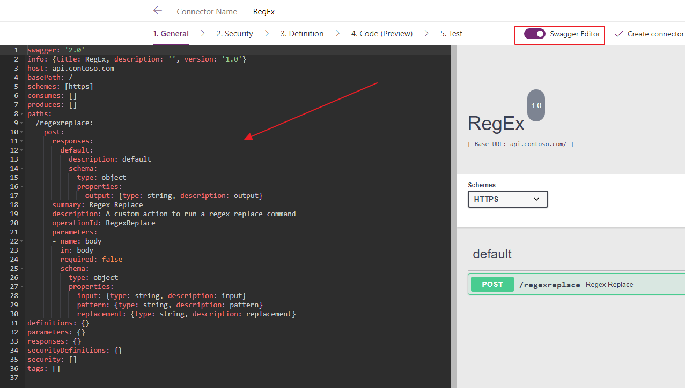
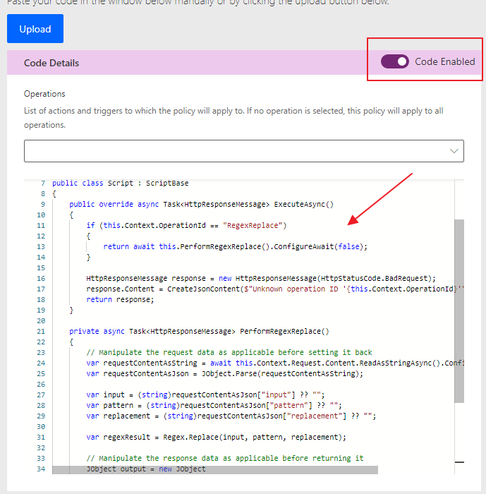
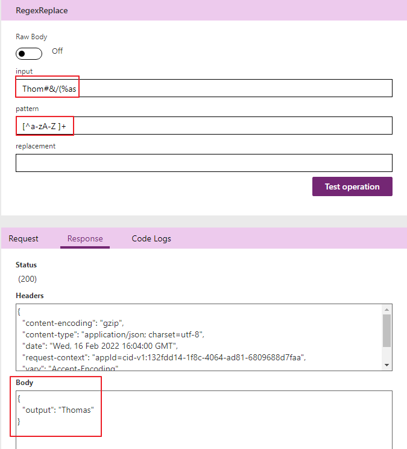

Custom connector made to pick out random GIF's from Giphy. All you need is the tag for what you want and the API key. Enjoy😁

# Setup
Import the .json file the regular way durnig an import, but when you get to the code part, you ned to copy paste everything that is within the .cs file into the code. 

# Import Connector Definition

# Import Code Definition

# RegEx Result

